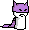
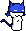
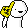
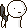
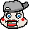
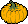
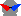

<h1 align="center" style="font-family: 'Courier New';">
    <b>
        
        </b>
    
    
    
     
    
    
    
</h1>

# Pesterchum Rewritten

*Pesterchum is an instant messaging client copying the look and feel of clients from Andrew Hussie's webcomic Homestuck.*

This repository is a clean, modernized version of [ghostDunk's Pesterchum](https://github.com/illuminatedwax/pesterchum/), based on [Lumi's Fork (Pesterchum Alt Servers)](https://github.com/Dpeta/pesterchum-alt-servers/releases), written from the ground up.

Some resources have been reused, such as themes and fonts.

## PLANNED FEATURES

 Every feature from Lumi's Fork <b>[click to expand]</b>: 

 - Updated dependencies; [Python 2 --> Python 3](https://www.python.org/doc/sunset-python-2/) // [Qt4 --> Qt5 & Qt6](https://www.qt.io/blog/2014/11/27/qt-4-8-x-support-to-be-extended-for-another-year)
 - Server Selection GUI
 - Client -> Server [TLS/SSL](https://en.wikipedia.org/wiki/Transport_Layer_Security) encryption
 - UTF-8 encoded text (emojis, non-western characters)
 - IRCv3 metadata protocol usage for privacy ("`previously any IRC user could see who you were messaging since it would send out a public GETMOOD request`")
 *- Tentative support for communicating color and timeline via [IRCv3 Message Tags/TAGMSG](https://ircv3.net/specs/extensions/message-tags#the-tagmsg-tag-only-message)
 - Expanded quirk customization: **Gradients**, **smilies/links exclusion**
 - Theme 
 - Funky [win95-theme](https://www.pesterchum.xyz/img/win95.png) by [cubicSimulation](https://twitter.com/cubicSimulation) 
 - Works better with high resolutions since size scales via Qt's [high DPI scaling](https://doc.qt.io/qt-6/highdpi.html) (https://github.com/Dpeta/pesterchum-alt-servers/issues/66)
 - Usable with Wayland on Linux, it used to break because of the way Pesterchum set its window position
 - Excecutables build with PyInstaller, allows for a smaller release filesize + dlls can be include with the binary
 - Lots of fixes for miscellaneous crashes/issues. . . check out the <a href="CHANGELOG.md">CHANGELOG</a>! :3

 - Built-in auto-updater

[CHANGELOG.md]: https://github.com/Dpeta/pesterchum-alt-servers/blob/main/CHANGELOG.md
[TODO.md]: https://github.com/Dpeta/pesterchum-alt-servers/blob/main/TODO.md

## INSTALLATION 

TBA

## DOCUMENTATION 

### Old Documentation
Additional, old resources, provided both because they still provide useful information, and for archival.
 - <a href="docs/themes.txt">HOW TO MAKE YOUR OWN THEME</a>
 - <a href="docs/trollquirks.mkdn">Canon troll quirk guide (REGEXP REPLACE)</a>
 - <a href="docs/PYQUIRKS.mkdn">Guide for setting up Python quirk functions</a>

Files available in [assets/docs/legacy](assets/docs/legacy).

### Wiki
I've been adding some info to [the wiki](https://github.com/Dpeta/pesterchum-alt-servers/wiki), the available pages as of me updating this readme are:
 - [Handle registration and ownership (nickServ)](https://github.com/Dpeta/pesterchum-alt-servers/wiki/Handle-registration-and-ownership)
 - [Memo registration and ownership (chanServ)](https://github.com/Dpeta/pesterchum-alt-servers/wiki/Memo-registration-and-ownership)

Some useful off-repo guides:
 - [How to register your handle with nickServ](https://squidmaid.tumblr.com/post/67595522089/how-to-register-your-pesterchum-handle-the-actual)
 - [Collection of gradient quirk function guides](https://paste.0xfc.de/?e60df5a155e93583#AmcgN9cRnCcBycmVMvw6KJ1YLKPXGbaSzZLbgAhoNCQD
)

The old READMEs are also preserved in the [docs](docs) folder:
- <a href="assets/docs/legacy/README-pesterchum.mkdn"> illuminatedWax's README</a>
- <a href="assets/docs/legacy/README-karxi.mkdn "> karxi's README</a>
- <a href="assets/docs/legacy/TODO.mkdn "> karxi's TODO</a>
- <a href="assets/docs/legacy/CHANGELOG-karxi.mkdn "> karxi's CHANGELOG</a>

## RUNNING FROM SOURCE 

TBA

### DEPENDENCIES
 - **[Python 3]**
     - Ideally 3.8 or later. Though older versions may still work, I don't intend to test them.
 - **[PySide6]**
	- PyQt5 support will not be provided for this version, as the intention is to start fresh and define a new baseline.
    - PyQt6 bindings have been replaced with PySide (official Python Qt bindings).
 - (Optional) **[certifi]**
 	- Provides alternative root certificates for TLS certificate validation. 
	- Useful for MacOS, as Python doesn't use the system-provided certificates because of MacOS' outdated SSL library. Also miscellaneous systems without usable root certificates.
 
### WALKTHROUGH

TBA
 
## FREEZE / BUILD 

TBA

## SMILIES 

| Text                 | Smilie                                                                                              |
|:---------------------|:----------------------------------------------------------------------------------------------------|
| `:rancorous:`        |                |
| `:apple:`            |                           |
| `:bathearst:`        |                   |
| `:cathearst:`        |                   |
| `:woeful:`           |                     |
| `:sorrow:`           |                      |
| `:pleasant:`         |                  |
| `:blueghost:`        |                  |
| `:slimer:`           |                         |
| `:candycorn:`        |                   |
| `:cheer:`            |                           |
| `:duhjohn:`          |                  |
| `:datrump:`          |                       |
| `:facepalm:`         |                     |
| `:bonk:`             |                         |
| `:mspa:`             |                        |
| `:gun:`              |                       |
| `:cal:`              |                            |
| `:amazedfirman:`     |          |
| `:amazed:`           |                      |
| `:chummy:`           |                      |
| `:cool:`             |                           |
| `:smooth:`           |                         |
| `:distraughtfirman:` |  |
| `:distraught:`       |              |
| `:insolent:`         |                  |
| `:bemused:`          |                    |
| `:3:`                |                             |
| `:mystified:`        |                |
| `:pranky:`           |                      |
| `:tense:`            |                        |
| `:record:`           |                         |
| `:squiddle:`         |                     |
| `:tab:`              |                               |
| `:beetip:`           |                   |
| `:flipout:`          |                        |
| `:befuddled:`        |                        |
| `:pumpkin:`          |                   |
| `:trollcool:`        |                   |
| `:jadecry:`          |                |
| `:ecstatic:`         |                     |
| `:relaxed:`          |                       |
| `:discontent:`       |                 |
| `:devious:`          |                       |
| `:sleek:`            |                           |
| `:detestful:`        |                   |
| `:mirthful:`         |                     |
| `:manipulative:`     |             |
| `:vigorous:`         |                     |
| `:perky:`            |                           |
| `:acceptant:`        |                   |
| `:olliesouty:`       |                 |
| `:billiards:`        |                   |
| `:billiardslarge:`   |              |
| `:whatdidyoudo:`     |             |
| `:brocool:`          |                     |
| `:trollbro:`         |                     |
| `:playagame:`        |                         |
| `:trollc00l:`        |                   |
| `:suckers:`          |                       |
| `:scorpio:`          |                       |
| `:shades:`           |                         |
| `:honk:`             |                             |
